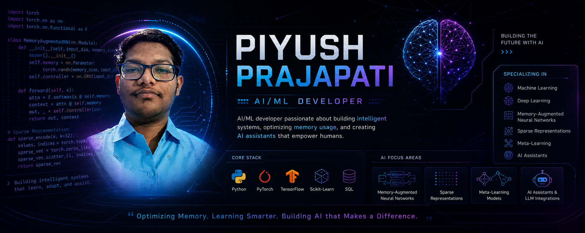

  

<h1 align="center">Hi 👋, I'm Piyush Prajapati</h1>

  

<h2 align="center">🚀 About Me</h2>

I’m Piyush Prajapati, an Engineering student passionate about building intelligent AI systems, 
Retrieval-Augmented Generation (RAG) pipelines, and Large Language Model applications.  
I specialize in Python, Generative AI, Machine Learning, and backend AI integration, with a focus on creating scalable and impactful real-world solutions.

Currently, I am developing AI-driven applications including recommendation systems, AI assistants, 
and intelligent educational platforms while continuously improving my expertise in Deep Learning, FastAPI, Transformers, and modern AI architectures.

<h2 align="Left">🧠 Core Competencies</h2>

🤖 Generative AI & LLM Applications  
📚 Retrieval-Augmented Generation (RAG) Systems  
🧠 Machine Learning & Deep Learning  
⚡ FastAPI Backend Development  
📊 Recommendation Systems & Intelligent Automation  
🔍 AI-Powered Real-World Problem Solving

<h2 align="Left">⚒️ Tech Stack</h2>

<h3 align="center">💻 Languages</h3>

<h3 align="center">🧠 AI / ML</h3>

OpenAI API • LangChain • Transformers • Scikit-Learn • RAG Pipelines

<h3 align="center">🛠️ Tools & Platforms</h3>

<h2 align="Left">🔥 Current Ventures & Goals</h2>

🔭 <b>Currently Working On:</b> Improving retrieval accuracy and response generation in RAG-based AI systems   

🌱 <b>Currently Learning:</b> Advanced Deep Learning, Reinforcement Learning, Prompt Engineering, and LLM Architectures   

👯 <b>Looking to Collaborate On:</b> Open-source AI projects, Generative AI applications, and intelligent backend systems   

💡 <b>Career Goal:</b> Building scalable AI systems and contributing to impactful AI/ML innovations globally

<h2 align="Left">📊 GitHub Analytics</h2>

  
  
  

  

<h2 align="Left">🏆 Featured Projects</h2>

🎯 Anime Recommendation System using Hybrid Filtering  
🏥 Blockchain-Powered Healthcare Record System  
🤖 AI Assistants & Intelligent Chatbots  
📷 Computer Vision and Deep Learning Projects

<h2 align="Left">🌐 Connect With Me</h2>

